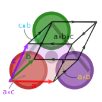

<p align="center">
  
</p>

# DirectSum.jl

*Abstract tangent bundle vector space type operations at compile-time*

[](https://zenodo.org/badge/latestdoi/169765288)
[](https://grassmann.crucialflow.com/stable)
[](https://grassmann.crucialflow.com/dev)
[](https://gitter.im/Grassmann-jl/community?utm_source=badge&utm_medium=badge&utm_campaign=pr-badge)
[](https://travis-ci.org/chakravala/DirectSum.jl)
[](https://ci.appveyor.com/project/chakravala/directsum-jl)
[](https://coveralls.io/github/chakravala/DirectSum.jl?branch=master)
[](https://codecov.io/github/chakravala/DirectSum.jl?branch=master)

This package is a work in progress providing the necessary tools to work with arbitrary `Manifold` elements specified with an encoding having optional origin, point at infinity, and tangent bundle parameter.
Due to the parametric type system for the generating `TensorBundle`, the Julia compiler can fully preallocate and often cache values efficiently ahead of run-time.
Although intended for use with the [Grassmann.jl](https://github.com/chakravala/Grassmann.jl) package, `DirectSum` can be used independently.

Sponsor this at [liberapay](https://liberapay.com/chakravala), [GitHub Sponsors](https://github.com/sponsors/chakravala), [Patreon](https://patreon.com/dreamscatter), or [Bandcamp](https://music.crucialflow.com); also available as part of the [Tidelift](https://tidelift.com/funding/github/julia/Grassmann) Subscription.

## DirectSum yields `TensorBundle` parametric type polymorphism ⨁

Let `n` be the rank of a `Manifold`.
The type `TensorBundle{n,ℙ,g,ν,μ}` uses *byte-encoded* data available at pre-compilation, where
`ℙ` specifies the basis for up and down projection,
`g` is a bilinear form that specifies the metric of the space,
and `μ` is an integer specifying the order of the tangent bundle (i.e. multiplicity limit of Leibniz-Taylor monomials). Lastly, `ν` is the number of tangent variables.

The metric signature of the basis elements of a vector space `V` can be specified with the `V"..."` constructor by using `+` and `-` to specify whether the basis element of the corresponding index squares to `+1` or `-1`.
For example, `S"+++"` constructs a positive definite 3-dimensional `TensorBundle`.
```julia
julia> ℝ^3 == V"+++" == TensorBundle(3)
true
```
It is also possible to specify an arbitrary `DiagonalForm` having numerical values for the basis with degeneracy `D"1,1,1,0"`, although the `Signature` format has a more compact representation.
Further development will result in more metric types.

The direct sum operator `⊕` can be used to join spaces (alternatively `+`), and `'` is an involution which toggles a dual vector space with inverted signature.
```julia
julia> V = ℝ'⊕ℝ^3
⟨-+++⟩

julia> V'
⟨+---⟩'

julia> W = V⊕V'
⟨-++++---⟩*
```
The direct sum of a `TensorBundle` and its dual `V⊕V'` represents the full mother space `V*`.
```julia
julia> collect(V) # all SubManifold vector basis elements
DirectSum.Basis{⟨-+++⟩,16}(⟨____⟩, ⟨-___⟩, ⟨_+__⟩, ⟨__+_⟩, ⟨___+⟩, ⟨-+__⟩, ⟨-_+_⟩, ⟨-__+⟩, ⟨_++_⟩, ⟨_+_+⟩, ⟨__++⟩, ⟨-++_⟩, ⟨-+_+⟩, ⟨-_++⟩, ⟨_+++⟩, ⟨-+++⟩)

julia> collect(SubManifold(V')) # all covector basis elements
DirectSum.Basis{⟨+---⟩',16}(w, w¹, w², w³, w⁴, w¹², w¹³, w¹⁴, w²³, w²⁴, w³⁴, w¹²³, w¹²⁴, w¹³⁴, w²³⁴, w¹²³⁴)

julia> collect(SubManifold(W)) # all mixed basis elements
DirectSum.Basis{⟨-++++---⟩*,256}(v, v₁, v₂, v₃, v₄, w¹, w², w³, w⁴, v₁₂, v₁₃, v₁₄, v₁w¹, v₁w², v₁w³, v₁w⁴, v₂₃, v₂₄, v₂w¹, v₂w², v₂w³, v₂w⁴, v₃₄, v₃w¹, v₃w², v₃w³, v₃w⁴, v₄w¹, v₄w², v₄w³, v₄w⁴, w¹², w¹³, w¹⁴, w²³, w²⁴, w³⁴, v₁₂₃, v₁₂₄, v₁₂w¹, v₁₂w², v₁₂w³, v₁₂w⁴, v₁₃₄, v₁₃w¹, v₁₃w², v₁₃w³, v₁₃w⁴, v₁₄w¹, v₁₄w², v₁₄w³, v₁₄w⁴, v₁w¹², v₁w¹³, v₁w¹⁴, v₁w²³, v₁w²⁴, v₁w³⁴, v₂₃₄, v₂₃w¹, v₂₃w², v₂₃w³, v₂₃w⁴, v₂₄w¹, v₂₄w², v₂₄w³, v₂₄w⁴, v₂w¹², v₂w¹³, v₂w¹⁴, v₂w²³, v₂w²⁴, v₂w³⁴, v₃₄w¹, v₃₄w², v₃₄w³, v₃₄w⁴, v₃w¹², v₃w¹³, v₃w¹⁴, v₃w²³, v₃w²⁴, v₃w³⁴, v₄w¹², v₄w¹³, v₄w¹⁴, v₄w²³, v₄w²⁴, v₄w³⁴, w¹²³, w¹²⁴, w¹³⁴, w²³⁴, v₁₂₃₄, v₁₂₃w¹, v₁₂₃w², v₁₂₃w³, v₁₂₃w⁴, v₁₂₄w¹, v₁₂₄w², v₁₂₄w³, v₁₂₄w⁴, v₁₂w¹², v₁₂w¹³, v₁₂w¹⁴, v₁₂w²³, v₁₂w²⁴, v₁₂w³⁴, v₁₃₄w¹, v₁₃₄w², v₁₃₄w³, v₁₃₄w⁴, v₁₃w¹², v₁₃w¹³, v₁₃w¹⁴, v₁₃w²³, v₁₃w²⁴, v₁₃w³⁴, v₁₄w¹², v₁₄w¹³, v₁₄w¹⁴, v₁₄w²³, v₁₄w²⁴, v₁₄w³⁴, v₁w¹²³, v₁w¹²⁴, v₁w¹³⁴, v₁w²³⁴, v₂₃₄w¹, v₂₃₄w², v₂₃₄w³, v₂₃₄w⁴, v₂₃w¹², v₂₃w¹³, v₂₃w¹⁴, v₂₃w²³, v₂₃w²⁴, v₂₃w³⁴, v₂₄w¹², v₂₄w¹³, v₂₄w¹⁴, v₂₄w²³, v₂₄w²⁴, v₂₄w³⁴, v₂w¹²³, v₂w¹²⁴, v₂w¹³⁴, v₂w²³⁴, v₃₄w¹², v₃₄w¹³, v₃₄w¹⁴, v₃₄w²³, v₃₄w²⁴, v₃₄w³⁴, v₃w¹²³, v₃w¹²⁴, v₃w¹³⁴, v₃w²³⁴, v₄w¹²³, v₄w¹²⁴, v₄w¹³⁴, v₄w²³⁴, w¹²³⁴, v₁₂₃₄w¹, v₁₂₃₄w², v₁₂₃₄w³, v₁₂₃₄w⁴, v₁₂₃w¹², v₁₂₃w¹³, v₁₂₃w¹⁴, v₁₂₃w²³, v₁₂₃w²⁴, v₁₂₃w³⁴, v₁₂₄w¹², v₁₂₄w¹³, v₁₂₄w¹⁴, v₁₂₄w²³, v₁₂₄w²⁴, v₁₂₄w³⁴, v₁₂w¹²³, v₁₂w¹²⁴, v₁₂w¹³⁴, v₁₂w²³⁴, v₁₃₄w¹², v₁₃₄w¹³, v₁₃₄w¹⁴, v₁₃₄w²³, v₁₃₄w²⁴, v₁₃₄w³⁴, v₁₃w¹²³, v₁₃w¹²⁴, v₁₃w¹³⁴, v₁₃w²³⁴, v₁₄w¹²³, v₁₄w¹²⁴, v₁₄w¹³⁴, v₁₄w²³⁴, v₁w¹²³⁴, v₂₃₄w¹², v₂₃₄w¹³, v₂₃₄w¹⁴, v₂₃₄w²³, v₂₃₄w²⁴, v₂₃₄w³⁴, v₂₃w¹²³, v₂₃w¹²⁴, v₂₃w¹³⁴, v₂₃w²³⁴, v₂₄w¹²³, v₂₄w¹²⁴, v₂₄w¹³⁴, v₂₄w²³⁴, v₂w¹²³⁴, v₃₄w¹²³, v₃₄w¹²⁴, v₃₄w¹³⁴, v₃₄w²³⁴, v₃w¹²³⁴, v₄w¹²³⁴, v₁₂₃₄w¹², v₁₂₃₄w¹³, v₁₂₃₄w¹⁴, v₁₂₃₄w²³, v₁₂₃₄w²⁴, v₁₂₃₄w³⁴, v₁₂₃w¹²³, v₁₂₃w¹²⁴, v₁₂₃w¹³⁴, v₁₂₃w²³⁴, v₁₂₄w¹²³, v₁₂₄w¹²⁴, v₁₂₄w¹³⁴, v₁₂₄w²³⁴, v₁₂w¹²³⁴, v₁₃₄w¹²³, v₁₃₄w¹²⁴, v₁₃₄w¹³⁴, v₁₃₄w²³⁴, v₁₃w¹²³⁴, v₁₄w¹²³⁴, v₂₃₄w¹²³, v₂₃₄w¹²⁴, v₂₃₄w¹³⁴, v₂₃₄w²³⁴, v₂₃w¹²³⁴, v₂₄w¹²³⁴, v₃₄w¹²³⁴, v₁₂₃₄w¹²³, v₁₂₃₄w¹²⁴, v₁₂₃₄w¹³⁴, v₁₂₃₄w²³⁴, v₁₂₃w¹²³⁴, v₁₂₄w¹²³⁴, v₁₃₄w¹²³⁴, v₂₃₄w¹²³⁴, v₁₂₃₄w¹²³⁴)
```

### Compile-time type operations make code optimization easier

In addition to the direct-sum operation, several others operations are supported, such as `∪, ∩, ⊆, ⊇` for set operations.
Due to the design of the `TensorBundle` dispatch, these operations enable code optimizations at compile-time provided by the bit parameters.
```Julia
julia> ℝ⊕ℝ' ⊇ TensorBundle(1)
true

julia> ℝ ∩ ℝ' == TensorBundle(0)
true

julia> ℝ ∪ ℝ' == ℝ⊕ℝ'
true
```
**Remark**, although some of the operations sometimes result in the same value as shown in the above examples, the `∪` and `⊕` are entirely different operations in general.

Calling manifolds with sets of indices constructs the subspace representations.
Given `M(s::Int...)` one can encode `SubManifold{M,length(s),indexbits(s)}` with induced orthogonal space, such that computing unions of submanifolds is done by inspecting the parameter ``s``.
Operations on `Manifold` types is automatically handled at compile time.
```julia
julia> (ℝ^5)(3,5)
⟨__+_+⟩

julia> dump(ans)
SubManifold{2,⟨+++++⟩,0x0000000000000014} ⟨__+_+⟩
```
Here, calling a `Manifold` with a set of indices produces a `SubManifold` representation.

### Extended dual index printing with full alphanumeric characters #62'

To help provide a commonly shared and readable indexing to the user, some print methods are provided:
```julia
julia> DirectSum.printindices(stdout,DirectSum.indices(UInt(2^62-1)),false,"v")
v₁₂₃₄₅₆₇₈₉₀abcdefghijklmnopqrstuvwxyzABCDEFGHIJKLMNOPQRSTUVWXYZ

julia> DirectSum.printindices(stdout,DirectSum.indices(UInt(2^62-1)),false,"w")
w¹²³⁴⁵⁶⁷⁸⁹⁰ABCDEFGHIJKLMNOPQRSTUVWXYZabcdefghijklmnopqrstuvwxyz
```
An application of this is in the `Grasmann` package, where dual indexing is used.

### Additional features for conformal projective geometry null-basis

Declaring an additional plane at infinity is done by specifying it in the string constructor with ``\infty`` at the first index (i.e. Riemann sphere `S"∞+++"`). The hyperbolic geometry can be declared by ``\emptyset`` subsequently (i.e. Minkowski spacetime `S"∅+++"`).
Additionally, the *null-basis* based on the projective split for confromal geometric algebra would be specified with `∞∅` initially (i.e. 5D CGA `S"∞∅+++"`). These two declared basis elements are interpreted in the type system.
```julia
julia> Signature("∞∅++")
⟨∞∅++⟩
```
The index number `n` of the `TensorBundle` corresponds to the total number of generator elements. However, even though `V"∞∅+++"` is of type `TensorBundle{5,3}` with `5` generator elements, it can be internally recognized in the direct sum algebra as being an embedding of a 3-index `TensorBundle{3,0}` with additional encoding of the null-basis (origin and point at infinity) in the parameter `ℙ` of the `TensorBundle{n,ℙ}` type.

### Tangent bundle

The `tangent` map takes `V` to its tangent space and can be applied repeatedly for higher orders, such that `tangent(V,μ,ν)` can be used to specify `μ` and `ν`.
```julia
julia> V = tangent(ℝ^3)
T¹⟨+++₁⟩

julia> tangent(V')
T²⟨----¹⟩'

julia> V+V'
T¹⟨+++---₁¹⟩*
```

## Interoperability for `TensorAlgebra{V}`

The `AbstractTensors` package is intended for universal interoperability of the abstract `TensorAlgebra` type system.
All `TensorAlgebra{V}` subtypes have type parameter `V`, used to store a `TensorBundle` value obtained from *DirectSum.jl*.
By itself, this package does not impose any specifications or structure on the `TensorAlgebra{V}` subtypes and elements, aside from requiring `V` to be a `TensorBundle`.
This means that different packages can create tensor types having a common underlying `TensorBundle` structure.

The key to making the whole interoperability work is that each `TensorAlgebra` subtype shares a `TensorBundle` parameter (with all `isbitstype` parameters), which contains all the info needed at compile time to make decisions about conversions. So other packages need only use the vector space information to decide on how to convert based on the implementation of a type. If external methods are needed, they can be loaded by `Requires` when making a separate package with `TensorAlgebra` interoperability.

Since `TensorBundle` choices are fundamental to `TensorAlgebra` operations, the universal interoperability between `TensorAlgebra{V}` elements with different associated `TensorBundle` choices is naturally realized by applying the `union` morphism to operations.

More information about `AbstractTensors` is available  at https://github.com/chakravala/AbstractTensors.jl

# Grassmann elements and geometric algebra Λ(V)

The Grassmann `SubManifold` elements `vₖ` and `wᵏ` are linearly independent vector and covector elements of `V`, while the Leibniz `Operator` elements `∂ₖ` are partial tangent derivations and `ϵᵏ` are dependent functions of the `tangent` manifold.
An element of a mixed-symmetry `TensorAlgebra{V}` is a multilinear mapping that is formally constructed by taking the tensor products of linear and multilinear maps.
Higher `grade` elements correspond to `SubManifold` subspaces, while higher `order` function elements become homogenous polynomials and Taylor series.

Combining the linear basis generating elements with each other using the multilinear tensor product yields a graded (decomposable) tensor `SubManifold` ⟨w₁⊗⋯⊗wₖ⟩, where `grade` is determined by the number of anti-symmetric basis elements in its tensor product decomposition.
The algebra is partitioned into both symmetric and anti-symmetric tensor equivalence classes.
For the oriented sets of the Grassmann exterior algebra, the parity of `(-1)^P` is factored into transposition compositions when interchanging ordering of the tensor product argument permutations.
The symmetrical algebra does not need to track this parity, but has higher multiplicities in its indices.
Symmetric differential function algebra of Leibniz trivializes the orientation into a single class of index multi-sets, while Grassmann's exterior algebra is partitioned into two oriented equivalence classes by anti-symmetry.
Full tensor algebra can be sub-partitioned into equivalence classes in multiple ways based on the element symmetry, grade, and metric signature composite properties.

By virtue of Julia's multiple dispatch on the field type `𝕂`, methods can specialize on the dimension `n` and grade `G` with a `TensorBundle{n}` via the `TensorAlgebra{V}` subtypes, such as `SubManifold{V,G}`, `Simplex{V,G,B,𝕂}`.

The elements of the `Basis` can be generated in many ways using the `SubManifold` elements created by the `@basis` macro,
```julia
julia> using DirectSum; @basis ℝ^3 # equivalent to basis"+++"
(⟨+++⟩, v, v₁, v₂, v₃, v₁₂, v₁₃, v₂₃, v₁₂₃)

julia> typeof(V) # dispatch by vector space
Signature{3,0,0x0000000000000000,0,0,1}

julia> typeof(v13) # extensive type info
SubManifold{⟨+++⟩,2,0x0000000000000005}

julia> v1 ⊆ v12
true

julia> v12 ⊆ V
true
```
As a result of this macro, all of the `SubManifold{V,G}` elements generated by that `TensorBundle` become available in the local workspace with the specified naming.
The first argument provides signature specifications, the second argument is the variable name for the `TensorBundle`, and the third and fourth argument are the the prefixes of the `SubManifold` vector names (and covector basis names). By default, `V` is assigned the `TensorBundle` and `v` is the prefix for the `SubManifold` elements.

It is entirely possible to assign multiple different bases with different signatures without any problems. In the following command, the `@basis` macro arguments are used to assign the vector space name to `S` instead of `V` and basis elements to `b` instead of `v`, so that their local names do not interfere.
Alternatively, if you do not wish to assign these variables to your local workspace, the versatile `DirctSum.Basis` constructors can be used to contain them, which is exported to the user as the method `Λ(V)`.
```julia
julia> @basis 3 S b
(⟨+++⟩, v, v₁, v₂, v₃, v₁₂, v₁₃, v₂₃, v₁₂₃)

julia> indices(Λ(3).v12)
2-element Array{Int64,1}:
 1
 2
```
The parametric type formalism in `DirectSum` is highly expressive to enable the pre-allocation of geometric algebra computations for specific sparse-subalgebras, including the representation of rotational groups, Lie bivector algebras, and affine projective geometry.

## Approaching ∞ dimensions with `SparseBasis` and `ExtendedBasis`

In order to work with a `TensorAlgebra{V}`, it is necessary for some computations to be cached. This is usually done automatically when accessed.
Staging of precompilation and caching is designed so that a user can smoothly transition between very high dimensional and low dimensional algebras in a single session, with varying levels of extra caching and optimizations.
The parametric type formalism in `DirectSum` is highly expressive and enables pre-allocation of geometric algebra computations involving specific sparse subalgebras, including the representation of rotational groups.

It is possible to reach `Simplex` elements with up to `N=62` vertices from a `TensorAlgebra` having higher maximum dimensions than supported by Julia natively.
The 62 indices require full alpha-numeric labeling with lower-case and capital letters. This now allows you to reach up to `4,611,686,018,427,387,904` dimensions with Julia `using DirectSum`. Then the volume element is
```julia
v₁₂₃₄₅₆₇₈₉₀abcdefghijklmnopqrstuvwxyzABCDEFGHIJKLMNOPQRSTUVWXYZ
```
Complete `SubManifold` allocations are only possible for `N≤22`, but sparse operations are also available at higher dimensions.
While `DirectSum.Basis{V}` is a container for the `TensorAlgebra` generators of `V`, the `DirectSum.Basis` is only cached for `N≤8`.
For the range of dimensions `8<N≤22`$, the `DirectSum.SparseBasis` type is used.
```julia
julia> Λ(22)
DirectSum.SparseBasis{⟨++++++++++++++++++++++⟩,4194304}(v, ..., v₁₂₃₄₅₆₇₈₉₀abcdefghijkl)
```
This is the largest `SparseBasis` that can be generated with Julia, due to array size limitations.

To reach higher dimensions with `N>22`, the `DirectSum.ExtendedBasis` type is used.
It is suficient to work with a 64-bit representation (which is the default). And it turns out that with 62 standard keyboard characters, this fits nicely.
At 22 dimensions and lower there is better caching, with further extra caching for 8 dimensions or less.
Thus, the largest Hilbert space that is fully reachable has 4,194,304 dimensions, but we can still reach out to 4,611,686,018,427,387,904 dimensions with the `ExtendedBasis` built in.
Complete `SubManifold` elements are not representable when `ExtendedBasis` is used, but the performance of the `SubManifold` and sparse elements is possible as it is for lower dimensions for the current `SubAlgebra` and `TensorAlgebra` types.
The sparse representations are a work in progress to be improved with time.

### Future work

This package is still in its beginning stages and may have deprecating changes.
